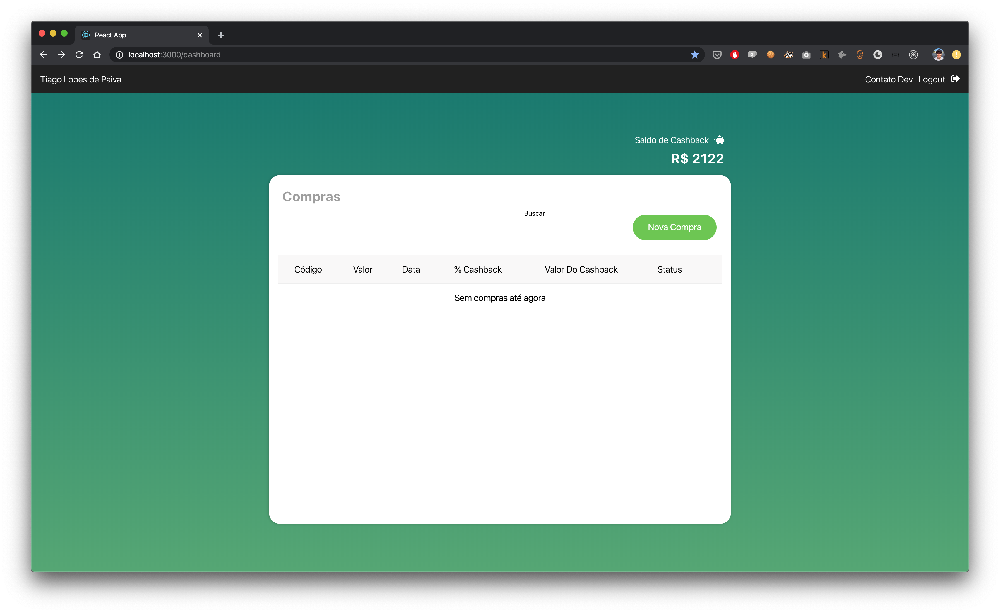

# Eu revendedor App

O app consiste em um um sistema para seus revendedores(as) cadastrarem suas compras e acompanhar o retorno de cashback de cada um.

App: [https://eurevendedor.herokuapp.com/](https://eurevendedor.herokuapp.com/)

Contato: tiagoapolo@gmail.com

#### Pré-requisitos

- Node.JS (12.x) => [**Instalação**](https://nodejs.org/en/download/)
- NPM (6.x)

## Passos para rodar localmente

Instale os pacotes necessários:

`$ npm i`

Rode o servidor de backend (PORTA 8888):

`$ npm run server`

Rode o App (PORTA 3000):

`$ npm start`

## Backend

Porta em uso: 8888

Rotas

Autentica o usuário

- POST /api/auth:

  - body: { email, password } 

Retorna o saldo do cashback

- GET /api/cashback:
  
  - query: cpf

Retorna compras de um usuário (user_id)

- GET /api/purchases:
  
  - query: user_id

Retorna o saldo do cashback

- GET /api/purchases:
  
  - query: user_id

Retorna a lista de status disponíveis

- GET /api/status:
  

Retorna compras de um usuário (user_id)

- GET /api/purchases:
  
  - query: user_id

Registra compra de um usuário

- POST /api/purchases:
  
  - body: 
      - id
      - user_id
      - value
      - date
      - cashback_percentage
      - cashback
      - status  

Edita compra de um usuário

- PUT /api/purchases/:id :

  - params: id
  
  - body: 
      - id
      - user_id
      - value
      - date
      - cashback_percentage
      - cashback
      - status  

Deleta a compra de um usuário

- DELETE /api/purchases/:id

  - params: id